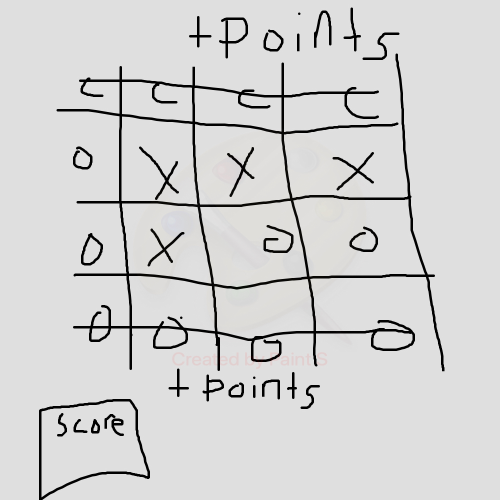

# Candy Crush!
https://hoan-k-le.github.io/Zombie-Candy-Crush/

## What the game is about

Be quick and match the zombies by 3's to get points! 
The more matches the more points you get! 
Must get 35 points before the time end to win!

## MVP
<ul>
<li>Create a grid 8x8</li>
<li>Create the zombies to match with each other</li>
<li>3 same match = points</li>
<li>Create a scoreboard</li>
<li>Create a countdown timer</li>
</ul>

## Stretch
<ul>
 <li>Create level 2 where there is limited turns<li>
 <li>Create better graphics<li>
 <li>More realistic grid</li>
 <li>Create different levels(easy, medium, hardmode)</li>
 <li>Add better obstacles</li>
</ul>

## Type of tech
HTML, CSS, Javascript

## Resources 
<ul>
<li>StackOverFlow</li>
<li>Video's| https://www.youtube.com/watch?v=sD3Os4H_EOU&ab_channel=KennyYipCoding (how to build doremon slide)</li>
<li>mozilla</li>
<li>dev.to</li>

  